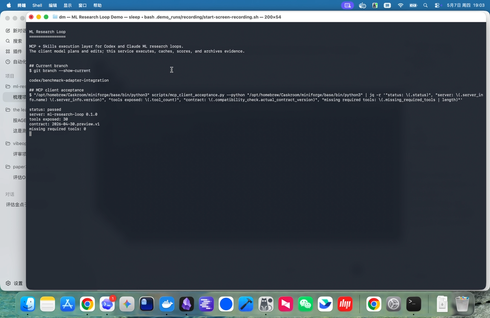

# ML Research Loop

[](https://github.com/MagicianDu/ml-research-loop/actions/workflows/ci.yml)
[](LICENSE)
[](docs/release-notes.md)
[](pyproject.toml)

MCP-native ML research loop for Codex and Claude.

ML Research Loop fuses the research-planning side of **ml-intern** with the
fixed-budget experiment loop of **autoresearch**. Codex or Claude acts as the
planner; this repository provides the local MCP tools, skills, artifact store,
experiment runner, evidence checks, patch guards, and reproducibility signals
needed to turn research ideas into bounded ML experiments.

## Demo

[](https://github.com/MagicianDu/ml-research-loop/releases/download/v0.1.0-preview/ml-research-loop-launch-demo-720p.mp4)

Watch the 60-second launch demo:
[MP4 release asset](https://github.com/MagicianDu/ml-research-loop/releases/download/v0.1.0-preview/ml-research-loop-launch-demo-720p.mp4).
It shows MCP client acceptance, benchmark readiness, the evidence index, and a
Codex-assisted PaperBench review with explicit claim boundaries.

## Public Evidence

The current preview includes reproducible local proof artifacts, but does not
claim official leaderboard scores. Full details are tracked in the
[benchmark evidence index](docs/evidence/benchmark-results-index-cn.md).

| Track | Evidence | Current result | Public claim boundary |
| --- | --- | --- | --- |
| MLE-bench | [spooky-author-identification proof](docs/evidence/mle-bench-spooky-20260507-cn.md) | Local official scorer proof improves log loss from `1.08468` to `0.37038`, above median threshold `0.418785` | Local proof run only; not a leaderboard claim |
| PaperBench | [rice debug harness](docs/evidence/paperbench-debug-dummy-20260507-cn.md) | Official debug split runs through dummy solver + dummy judge with zero failure categories | Harness integration proof only; not reproduction quality |
| PaperBench review | [Codex-assisted review](docs/evidence/paperbench-codex-review-rice-20260507-cn.md) | Codex-assisted rubric review records score `0.0` with evidence gaps | Keyless review workflow only; not an official PaperBench score |
| Real paper pilot | [Real-paper proof index](docs/evidence/real-paper-pilot-index.json) | MemFlow routing pilot and Adam optimizer pilot both run bounded public mini-slice baseline, ablation, client handoff, guarded iteration, dataset provenance, review report, and proof archive | Local public-slice proof with limitations review only; not full paper reproduction or official score |
| Full reproduction track | [fastText AG News baseline](docs/evidence/fasttext-ag-news-real-baseline-20260513-cn.md) + [P3 patch round](docs/evidence/fasttext-ag-news-p3-patch-round-20260513-cn.md) + [P4 proof bundle](docs/evidence/fasttext-ag-news-p4-proof-bundle-20260514-cn.md) | Full AG News CSV + local official fastText binary produced baseline `P@1=0.914`; one bounded client-style proposal `-wordNgrams 2` improved to `P@1=0.916`; P4 archived 10 reviewed/hash-indexed artifacts | Local reproducible baseline, one controlled patch-loop proof, and reviewed proof bundle only; not a leaderboard score, not all paper tables, and not arbitrary automatic research improvement |

- 中文产品说明: [docs/product-overview-cn.md](docs/product-overview-cn.md)
- 项目整体说明: [docs/project-overview-cn.md](docs/project-overview-cn.md)
- 单篇真实论文复现试点: [docs/reproduction-pilot/memflow-single-paper-pilot-cn.md](docs/reproduction-pilot/memflow-single-paper-pilot-cn.md)
- Adam 优化器复现试点: [docs/reproduction-pilot/adam-single-paper-pilot-cn.md](docs/reproduction-pilot/adam-single-paper-pilot-cn.md)
- 完整论文复现目标: [docs/reproduction-pilot/full-reproduction-fasttext-target-cn.md](docs/reproduction-pilot/full-reproduction-fasttext-target-cn.md)
- fastText/AG News 真实本地 baseline 证据: [docs/evidence/fasttext-ag-news-real-baseline-20260513-cn.md](docs/evidence/fasttext-ag-news-real-baseline-20260513-cn.md)
- fastText/AG News P3 真实 patch round 证据: [docs/evidence/fasttext-ag-news-p3-patch-round-20260513-cn.md](docs/evidence/fasttext-ag-news-p3-patch-round-20260513-cn.md)
- fastText/AG News P4 proof bundle 证据: [docs/evidence/fasttext-ag-news-p4-proof-bundle-20260514-cn.md](docs/evidence/fasttext-ag-news-p4-proof-bundle-20260514-cn.md)
- 复现 Case 模板: [docs/reproduction-pilot/reproduction-case-template-cn.md](docs/reproduction-pilot/reproduction-case-template-cn.md)
- 真实论文试点证据索引: [docs/evidence/real-paper-pilot-index.json](docs/evidence/real-paper-pilot-index.json)
- 公开声明映射: [docs/evidence/public-claims-map.json](docs/evidence/public-claims-map.json)
- 开源差异化说明: [docs/open-source-positioning-cn.md](docs/open-source-positioning-cn.md)
- 演示 transcript: [docs/demo-transcript-cn.md](docs/demo-transcript-cn.md)
- 5 分钟发布演示: [docs/launch-demo-cn.md](docs/launch-demo-cn.md)
- 宣传物料包: [docs/marketing/README.md](docs/marketing/README.md)
- Benchmark adapter roadmap: [docs/benchmark-adapter-roadmap-cn.md](docs/benchmark-adapter-roadmap-cn.md)

## Try v0.1.0-preview

```bash
git clone https://github.com/MagicianDu/ml-research-loop.git
cd ml-research-loop
python3 -m venv .venv
. .venv/bin/activate
pip install -e ".[dev]"
python3 scripts/mcp_client_acceptance.py --python "$(which python3)"
ML_RESEARCH_LOOP_PYTHON="$(which python3)" \
python3 scripts/mcp_golden_path.py --max-experiments 1 --experiment-duration 30
ml-loop demo run --template byte-lm-smoke --runtime-root .demo_runs/byte-lm-smoke --json
```

Then connect Codex or Claude with `ml-loop init-mcp-config` and install the
workflow skills with `ml-loop init-skills`. If you try the preview, please
share feedback through [GitHub Issues](https://github.com/MagicianDu/ml-research-loop/issues/new/choose).
The pinned preview thread is
[#1 Try v0.1.0-preview and share feedback](https://github.com/MagicianDu/ml-research-loop/issues/1).
The short feedback guide is [docs/preview-feedback-cn.md](docs/preview-feedback-cn.md).
高校课程、科研机构和实验室试用请先阅读中文
[机构 pilot 指南](docs/institution-pilot-guide-cn.md)。指南包含 30 分钟本科实验、
2 小时硕博论文复现 mini lab、1 天实验室 benchmark trial、数据安全注意事项、
预期输入/输出 artifact 和失败反馈流程。Pilot 用户可以通过
[pilot feedback issue template](https://github.com/MagicianDu/ml-research-loop/issues/new?template=pilot_feedback.yml)
提交结构化反馈。
If a run fails, attach a redacted diagnostics bundle:

```bash
ml-loop feedback-bundle \
  --runtime-root .demo_runs/byte-lm-smoke \
  --task-id demo-byte-lm-smoke \
  --output-dir .demo_runs/feedback-bundle
```

## Why This Exists

Most LLM research agents can explain ideas. Fewer can give a strong model a
safe, repeatable execution layer for:

1. gathering paper, dataset, and code evidence;
2. turning evidence into testable hypotheses;
3. running local fixed-budget training experiments;
4. reviewing metrics, logs, dataset state, and code state;
5. proposing the next parameter or code patch;
6. preserving artifacts for audit and reproduction.

ML Research Loop keeps those concerns separated:

| Layer | Responsibility |
| --- | --- |
| Codex / Claude | Understand the goal, choose tools, inspect state, decide the next move |
| Skills | Encode workflow policy, evidence thresholds, stop rules, and human review boundaries |
| MCP service | Execute retrieval, experiments, review, patch preflight, logs, and artifact management |
| Runtime artifacts | Store tasks, results, workdirs, snapshots, logs, reproduction specs, and grade reports |

The server does **not** implicitly call a service-side LLM. If you want
server-side autonomous experiment planning, call `run_ai_autoresearch`
explicitly and provide a configured provider.

## What Is Different

- **ml-intern capability kept:** paper reading, research task planning,
  dataset/code evidence, provider coverage, source rankings, retrieval
  diagnostics, cache-aware recovery, and evidence citations.
- **autoresearch capability kept:** `program.md` task instructions, bounded
  `train.py` workspaces, hyperparameter search spaces, accept/reject decisions,
  progress JSON, result JSON, logs, and snapshots.
- **MCP + Skills product shape:** tools expose execution; skills teach
  Codex/Claude how to use the execution layer safely.
- **AIDE/PaperBench patterns absorbed:** experiment tree, best-node tracking,
  loop policy, reproduction readiness, rubric-style grade reports. These are
  architecture patterns, not required runtime dependencies.
- **Patch execution is guarded:** path sandboxing, stale-state checks,
  workspace-relative diffs, syntax/test preflight, rollback, and post-patch
  review are part of the public contract.

## Quick Start

```bash
git clone https://github.com/MagicianDu/ml-research-loop.git
cd ml-research-loop
python3 -m venv .venv
. .venv/bin/activate
pip install -e ".[dev]"
```

Run the MCP client contract check:

```bash
python3 scripts/mcp_client_acceptance.py --python "$(which python3)"
```

Run a bounded research-to-experiment demo:

```bash
ML_RESEARCH_LOOP_PYTHON="$(which python3)" \
python3 scripts/mcp_golden_path.py --max-experiments 1 --experiment-duration 30
```

Run a stable local template demo:

```bash
ml-loop demo list
ml-loop demo run --template byte-lm-smoke --runtime-root .demo_runs/byte-lm-smoke --json
```

Run the full local release gate:

```bash
ml-loop check --json
```

The full gate runs lint, tests, MCP stdio smoke, client acceptance, golden path,
multi-round loop, auto-next, client patch, provider quality, real-data,
real-code patch, and reproduction demos.

Inspect public benchmark proof-run readiness without running official
evaluations or claiming scores:

```bash
ml-loop benchmark proof-plan --json
```

Write a read-only setup bundle for an external official proof-run environment:

```bash
ml-loop benchmark setup-bundle --output-dir .demo_runs/proof-setup --json
```

Validate future proof-run artifacts before public claims:

```bash
ml-loop benchmark publication-bundle \
  --manifest .demo_runs/proof-artifacts/manifest.json \
  --artifact-root .demo_runs/proof-artifacts \
  --output-dir .demo_runs/proof-publication \
  --json
```

Archive complete proof-run artifacts with hashes:

```bash
ml-loop benchmark archive-proof \
  --manifest .demo_runs/proof-artifacts/manifest.json \
  --artifact-root .demo_runs/proof-artifacts \
  --output-dir .demo_runs/proof-archive \
  --json
```

The same proof lifecycle is also exposed through MCP tools for Codex/Claude:
`get_benchmark_harness_probe`, `plan_benchmark_proof_run`,
`write_benchmark_proof_setup_bundle`,
`write_benchmark_proof_publication_bundle`, and
`write_benchmark_proof_archive`. MCP write tools enforce allowed roots; set
`ML_RESEARCH_LOOP_ALLOWED_ROOTS` for external proof artifact directories.

## Connect Codex Or Claude

Generate a Codex config for the current checkout:

```bash
ml-loop init-mcp-config --client codex
```

Generate a Claude Code config:

```bash
ml-loop init-mcp-config --client claude-code --output /tmp/ml-research-loop.mcp.json
claude mcp add-json ml-research-loop "$(cat /tmp/ml-research-loop.mcp.json)"
```

Install the repository skills so the client model knows the intended workflow:

```bash
ml-loop init-skills --client codex
ml-loop init-skills --client claude
```

Config templates and fresh-checkout onboarding are in
[examples/mcp/README.md](examples/mcp/README.md). Full client setup is in
[docs/mcp-client-setup.md](docs/mcp-client-setup.md).
For a scripted walkthrough, see
[docs/demo-transcript-cn.md](docs/demo-transcript-cn.md) and
[docs/launch-demo-cn.md](docs/launch-demo-cn.md).

## Core MCP Tools

| Tool | Use |
| --- | --- |
| `get_service_manifest` | Read contract version, tool contracts, skill contracts, compatibility, and sandbox rules |
| `research_task` | Build ml-intern-style evidence context from papers, datasets, and code providers |
| `read_paper` | Read one paper by arXiv ID or URL and return findings and hypotheses |
| `propose_hypotheses` | Convert evidence into experiment-ready hypotheses |
| `run_hypothesis_experiment` | Run a bounded autoresearch experiment from a task config and optional task patch |
| `review_research_results` | Return research review, experiment tree, dataset profile, code plan, and planner actions |
| `run_next_experiment_from_review` | Execute the next task patch selected from a completed review |
| `run_client_patch_experiment` | Validate and execute a Codex/Claude single-parameter proposal |
| `apply_client_code_patch` | Apply a guarded workspace-relative code diff with rollback on failure |
| `run_fasttext_patch_round` | Execute one allowlisted fastText AG News reproduction-improvement proposal against an archived baseline |
| `write_fasttext_patch_round_proof_bundle` | Package a completed fastText patch round into a human-reviewed, hash-indexed proof bundle |
| `get_experiment_logs` | Return recent log tails for debugging failed or slow experiments |
| `list_runtime_artifacts` | Inspect tasks, results, workdirs, snapshots, archive, and known task IDs |
| `archive_runtime_artifacts` | Move one task's runtime artifacts into `archive/` |
| `clean_runtime_artifacts` | Delete one task's runtime artifacts only after `confirm=true` |
| `run_ai_autoresearch` | Opt-in server-side LLM loop for unattended runs |

## Typical Loop

```text
research_task / read_paper
  -> propose_hypotheses
  -> run_hypothesis_experiment
  -> review_research_results
  -> Codex/Claude reads experiment_state
  -> run_next_experiment_from_review or apply_client_code_patch
  -> review again
```

The important output for the client planner is `experiment_state`, including:

- `research_evidence_gate`
- `provider_coverage`
- `retrieval_diagnostics`
- `dataset_profile`
- `experiment_tree`
- `loop_policy`
- `reproduction.readiness`
- `code_change_plan.next_experiment_plan`
- `planner_actions`

## Skills

Repository-local skills live under [skills/](skills/):

| Skill | Purpose |
| --- | --- |
| `ml-research-loop-planner` | Main research and experiment planning workflow |
| `ml-research-loop-reproduction` | Paper reproduction, required files, rubric, and grade report workflow |
| `ml-research-loop-experiment-optimizer` | Multi-round metric-aware experiment optimization workflow |
| `ml-research-loop-operator` | Installation, release check, artifact management, and troubleshooting workflow |

Setup details are in [docs/skills-setup-cn.md](docs/skills-setup-cn.md).

## Product Status

Current status: **0.1.0 preview MCP product**.

The public contract is `2026-04-30.preview.v1`. Preview means the local service
is runnable and release-gated, but stable clients should still check
`get_service_manifest.contract_version` before planning automated loops.

Known boundaries:

- Live paper, dataset, and GitHub providers can be rate-limited.
- Offline demos are the deterministic acceptance path.
- AIDE and PaperBench are pattern sources, not runtime dependencies.
- Benchmark adapter demos and proof plans do not claim official MLE-bench or
  PaperBench scores.
- Stable release requires a tagged clean-checkout validation.

## Documentation Map

- Product overview: [docs/product-overview-cn.md](docs/product-overview-cn.md)
- Project architecture and state: [docs/project-overview-cn.md](docs/project-overview-cn.md)
- Open-source positioning: [docs/open-source-positioning-cn.md](docs/open-source-positioning-cn.md)
- Demo transcript: [docs/demo-transcript-cn.md](docs/demo-transcript-cn.md)
- Launch demo: [docs/launch-demo-cn.md](docs/launch-demo-cn.md)
- Fresh checkout validation: [docs/fresh-checkout-validation-cn.md](docs/fresh-checkout-validation-cn.md)
- Real paper reproduction demo: [docs/real-paper-reproduction-demo-cn.md](docs/real-paper-reproduction-demo-cn.md)
- Preview feedback guide: [docs/preview-feedback-cn.md](docs/preview-feedback-cn.md)
- MCP setup: [docs/mcp-client-setup.md](docs/mcp-client-setup.md)
- Client compatibility: [docs/client-compatibility-matrix.md](docs/client-compatibility-matrix.md)
- Hybrid MCP architecture: [docs/hybrid-mcp-architecture.md](docs/hybrid-mcp-architecture.md)
- Client planner template: [docs/client-planner-template.md](docs/client-planner-template.md)
- Skills setup: [docs/skills-setup-cn.md](docs/skills-setup-cn.md)
- Release checklist: [docs/release-checklist.md](docs/release-checklist.md)
- Release notes: [docs/release-notes.md](docs/release-notes.md)
- Roadmap: [docs/development-roadmap-cn.md](docs/development-roadmap-cn.md)

## Governance

- License: [LICENSE](LICENSE)
- Contributing: [CONTRIBUTING.md](CONTRIBUTING.md)
- Security policy: [SECURITY.md](SECURITY.md)
- Code of conduct: [CODE_OF_CONDUCT.md](CODE_OF_CONDUCT.md)
- Citation: [CITATION.cff](CITATION.cff)
- Upstream attribution and boundaries: [NOTICE](NOTICE)
