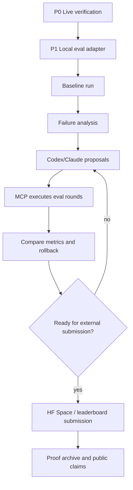

# Smol AI WorldCup 打榜完整计划

本文档是 ML Research Loop 第一条 Hugging Face 外部打榜路线。目标不是停留在候选目标，而是最终拿到可公开复核的 Hugging Face leaderboard 结果，并把它变成产品宣传证据。

## 目标

在 Smol AI WorldCup / SHIFT Benchmark 上完成一次真实打榜闭环：

1. 复刻官方公开评测规则和数据读取路径。
2. 选择一个本机可运行或可通过 HF Inference API 评测的小模型。
3. 跑出本地 baseline。
4. 让 Codex/Claude 基于失败样例提出 prompt、解码、路由或轻量模型改进 proposal。
5. MCP 执行受控迭代并记录指标变化。
6. 人工确认后进入 Hugging Face Space 评测或提交路径。
7. 归档公开结果、截图/API 响应、日志、配置、proof archive 和宣传声明边界。

最终希望形成一句可以对外宣传的话：

> ML Research Loop 在 Smol AI WorldCup 上完成了从外部榜单目标选择、本地 baseline、自动迭代到公开榜单结果归档的完整闭环。

这句话只有在 Hugging Face 上存在可公开复核结果后才能使用。

## 当前已确认事实

- 目标数据集：`ginigen-ai/smol-worldcup`。
- 数据规模：Season 1 当前为 125 个问题，`train` split。
- 评测对象：小型语言模型，重点看质量、诚实性、速度、大小和资源效率。
- 核心排名指标：`WCS = sqrt(SHIFT * PIR_norm)`。
- `SHIFT = H * 0.4 + I * 0.6`，其中 H 是 Honesty，I 是 Intelligence。
- `PIR = (I * H * F) / (S * T)`，其中 F 是速度、S 是模型规模、T 是资源消耗。
- Season 1 公开结果包含 18 个模型；当前榜首为 `GPT-OSS-20B`，WCS `82.6`。
- Space 代码公开了 `/evaluate` Gradio 评测入口和 `/api/results` JSON 结果接口。
- Space 当前评测逻辑支持 Hugging Face Inference API，也有部分自定义 endpoint。

## 打榜策略

### 首战定位

不直接追求全榜第一。首战目标是：

- 完成真实外部榜单闭环；
- 取得一个能公开展示的有效名次或可比较分数；
- 证明 ML Research Loop 能自动发现弱项并改进可控指标；
- 沉淀一套以后可复用到更多 HF benchmark 的外部打榜流程。

### 模型选择

第一阶段建议选择 3 类候选模型：

| 类型 | 候选 | 目的 |
| --- | --- | --- |
| 已在榜模型 | `openai/gpt-oss-20b:2` 对应或可映射的公开模型 | 作为本机/外部复核锚点，验证我们能否复现接近榜单行为 |
| 小型开源模型 | `Qwen/Qwen3-1.7B`、`HuggingFaceTB/SmolLM2-1.7B-Instruct`、`google/gemma-3-1b-it` | 更适合本机快速迭代和低成本打榜 |
| 产品展示模型 | 本机可跑的量化模型或后续轻量微调模型 | 用来证明项目能持续优化，而不是只调用现成 API |

M5 Max 64GB 可以支撑小模型本地推理和部分轻量训练，但正式榜单如果依赖 HF Inference API 或 Space 支持模型列表，需要按榜单规则确认是否接受本地模型、Hub 模型或自定义 endpoint。

## 阶段计划

### P0：Live Verification

目标：确认榜单当前仍可访问，提交路径真实可用。

任务：

- 打开 Hugging Face Dataset、Leaderboard Space、Space files。
- 记录当前 commit、数据集行数、字段、license、榜单更新时间。
- 检查 `/evaluate` 是否能选择自定义模型。
- 检查 `/api/results` 是否返回当前 leaderboard JSON。
- 确认是否需要 `HF_TOKEN`、`OPENAI_API_KEY`、自定义 endpoint 或 Space owner 权限。

产物：

- `hf-live-verification.json`
- `hf-target-contract.md`
- 截图或 API 响应归档

验收：

- 能明确回答“我们如何把一个模型结果写入或展示到榜单”。
- 如果只能本地复刻，必须标记为 `local-compatible-only`。

当前执行入口：

```bash
ml-loop hf-eval smol-worldcup-verify \
  --output-dir .demo_runs/hf-eval/smol-worldcup-p0 \
  --json
```

MCP 客户端入口：

- `write_smol_worldcup_live_verification`

当前 P0 live verification 结果：

- `status=verified_with_limitations`。
- 数据集 `ginigen-ai/smol-worldcup` 可访问，当前 `train` split 为 125 题。
- Dataset commit：`a304802ece2692d2beb3b3a62bf67c50b7f3c60b`。
- Space commit：`6b2b170d37f9bb26f07288c3b57ef0ce0c3f4f9d`。
- Space 代码检测到 `/evaluate` 和 `/api/results`。
- Space 支持模型列表当前检测到 13 个模型。
- `/api/results` 当前返回空结果，不能据此声明已有外部成绩。
- Space 仓库树未暴露 `smol_worldcup_s1.json` 和 `results.json`，外部提交或结果持久化方式需要人工确认。
- `llm_judge` 路径检测到 `OPENAI_API_KEY` 需求。

当前可进入 P1 本地 baseline；但在人工确认 Space 提交路径之前，不能宣传 Hugging Face 官方 leaderboard 成绩。

2026-05-20 追加 submission path probe 后的更新：

- CLI：`ml-loop hf-eval smol-worldcup-submission-probe --output-dir docs/hf-evaluation/smol-worldcup-submission-probe-20260520 --model openai/gpt-oss-20b --json`
- MCP：`write_smol_worldcup_submission_probe`
- `submission_path_status=blocked_for_local_predictions`。
- `/evaluate/gradio_api/openapi.json` 暴露 `start_eval`，但 Space source 中 `model_id not in SUPPORTED_MODELS` 会限制模型 ID。
- 当前 Space 接受 13 个固定模型 ID；本地 `openai/gpt-oss-20b` / LM Studio predictions 不能直接作为该 Space 的官方提交结果。
- 真正提交路线变为两条：选择 Space 支持模型 ID 触发评测，或 fork/PR Space 增加本地模型/provider/submission 合同。

### P1：本地评测复刻

目标：在本机复刻公开数据和评分逻辑，跑出 baseline。

任务：

- 下载或读取 `ginigen-ai/smol-worldcup` 数据集。
- 实现本地 eval adapter：
  - 读取 125 题；
  - 按 `auto_grade` 调用对应评分方法；
  - 对 `llm_judge` 先使用 heuristic fallback 或显式接入 Codex-assisted review；
  - 输出 H、I、SHIFT、速度、模型大小、RAM 估计、PIR、WCS。
- 对至少一个模型跑 baseline。
- 记录失败样例和类别分布。

产物：

- `smol-worldcup-baseline-report.json`
- `prediction.jsonl`
- `score-breakdown.json`
- `failure-cases.json`
- `runtime-profile.json`

验收：

- baseline 可重复运行。
- 所有 125 题都有 response、score、grading_method。
- `official_scores_claimed=false`，因为这一步还不是 HF leaderboard 结果。

当前执行入口：

```bash
ml-loop hf-eval smol-worldcup-baseline \
  --output-dir .demo_runs/hf-eval/smol-worldcup-p1 \
  --json
```

MCP 客户端入口：

- `run_smol_worldcup_local_baseline`

当前 P1 local-compatible baseline 结果：

- `baseline_strategy=local-abstain-baseline`。
- 125 题全部生成 response、score 和 grading_method。
- 输出文件：`smol-worldcup-baseline-report.json`、`prediction.jsonl`、`score-breakdown.json`、`failure-cases.json`、`runtime-profile.json`。
- 本地诊断指标：`H=62.5`、`I=0.073529`、`SHIFT=25.044117`。
- `PIR=null`、`WCS_local_diagnostic=null`，因为当前 baseline 不是实际模型推理，不能估算模型大小、真实吞吐和官方归一化效率。
- `official_scores_claimed=false`，不能宣传为 Hugging Face leaderboard 分数。

### P2：LM Studio 本地模型评测

目标：把真实本地小模型输出接入本地评分 adapter，为 Codex/Claude 后续 proposal 提供失败样例和可比较指标。

任务：

- 通过 OpenAI-compatible API 调用 LM Studio 本地模型。
- 对同一批 Smol AI WorldCup 题目生成 response。
- 复用 P1 本地评分 adapter，输出 H、I、SHIFT、速度、失败样例和 proposal seed。
- 保留 `official_scores_claimed=false`，不把本地评测说成 Hugging Face leaderboard。

产物：

- `smol-worldcup-model-eval-report.json`
- `prediction.jsonl`
- `score-breakdown.json`
- `failure-cases.json`
- `runtime-profile.json`
- `proposal-rounds/round-*/proposal.json`
- `proposal-rounds/round-*/score-report.json`
- `multi-round-report.json`

验收：

- CLI 子命令可触发：

```bash
ml-loop hf-eval smol-worldcup-model-eval \
  --output-dir .demo_runs/hf-eval/smol-worldcup-p2 \
  --base-url http://127.0.0.1:1234/v1 \
  --model openai/gpt-oss-20b \
  --limit 5 \
  --json
```

- MCP 客户端可调用 `run_smol_worldcup_model_eval` 触发同一条路径。
- 至少一次小样本 smoke 能写出完整 artifact。
- 后续 Codex/Claude 只能基于这些 artifact 提出下一轮 prompt、解码或 routing proposal；是否提交 Hugging Face 仍需要人工确认。

当前 P2 smoke 结果：

- 2026-05-18 使用 LM Studio `openai/gpt-oss-20b` 跑通 CLI 3 题 smoke，输出完整 model eval artifact，`H=66.666667`、`I=0.0`、`SHIFT=26.666667`。
- 同日通过 MCP 工具 `run_smol_worldcup_model_eval` 跑通 1 题 smoke，证明 Codex/Claude 可直接触发同一条本地评测路径。
- 摘要见 `docs/hf-evaluation/smol-worldcup-p2-smoke/README.md`。
- 当前还不是完整 125 题评测，也不是 Hugging Face 官方提交或榜单分数。

DeepSeek provider 接入路径：

- CLI/MCP 现在支持把 `deepseek-v4-flash` / `deepseek-v4-pro` 作为
  OpenAI-compatible provider 触发同一条本地诊断路径。
- 默认 API endpoint 为 `https://api.deepseek.com`，鉴权只读取环境变量
  `DEEPSEEK_API_KEY`；artifact 只记录环境变量名，不记录 secret。
- 可显式配置 `--thinking-mode enabled|disabled` 和
  `--reasoning-effort high|max`，用于复现 DeepSeek 官方 Chat Completions
  参数口径。
- `runtime-profile.json` 会记录基于官方 USD cache-miss input price 与
  output price 的保守成本估算；当前代码已把候选模型调用和 `llm_judge`
  rubric judge 调用都计入 token cost。实际扣费可能因 cache hit 或供应商改价而更低或不同。
- 这条路径仍然是本地诊断，不是 Hugging Face 官方提交、hidden-test 结果或
  leaderboard 分数。

示例：

```bash
export DEEPSEEK_API_KEY=...
ml-loop hf-eval smol-worldcup-model-eval \
  --output-dir .demo_runs/hf-eval/smol-worldcup-deepseek-v4-flash-full \
  --model-provider deepseek \
  --model deepseek-v4-flash \
  --prompt-profile p3-dev-v2 \
  --evaluation-split all \
  --thinking-mode enabled \
  --reasoning-effort high \
  --json
```

当前 DeepSeek full-run 结果：

- 2026-05-20 已完成 `deepseek-v4-flash` 和 `deepseek-v4-pro` 各 125 题
  full-run，摘要见 `docs/hf-evaluation/smol-worldcup-deepseek-v4-20260520/README.md`。
- Flash：`SHIFT=54.641176`、`WCS_local_diagnostic=73.91967`、
  failure count `65`，本次 artifact 的 candidate-call lower-bound cost 为 `$0.01502550`。
- Pro：`SHIFT=53.556471`、`WCS_local_diagnostic=73.182287`、
  failure count `69`，本次 artifact 的 candidate-call lower-bound cost 为 `$0.04863517`。
- 与历史 `openai/gpt-oss-20b` round-003 相比，总分更低；但在非
  `llm_judge` 的确定性自动评分子集上，DeepSeek Pro 为 `77.97%`，
  Flash 为 `72.93%`，历史 gpt-oss round-003 为 `72.84%`。
- 该结果暴露出 `llm_judge` 自评口径风险，后续需要固定独立 judge 或
  人工抽样复核，不能把 self-judge 差异直接宣传为模型能力差异。

### P3：自动迭代

目标：让 Codex/Claude 真正发挥规划能力，MCP 负责执行和归档。

可迭代方向：

- prompt 模板：强制 JSON 输出、减少 `<think>` 干扰、加入拒答边界。
- decoding 参数：temperature、max_tokens、stop sequence。
- routing：自动识别 `auto_grade` 和 category，为不同题型选择不同 prompt。
- self-check：对 hallucination、confidence、refusal 题增加二次校验。
- local model choice：对不同 league 尝试更合适的小模型。

任务：

- 从 baseline 中提取 top failure categories。
- 让 Codex/Claude 生成 proposal。
- MCP 执行 proposal。
- 比较 H、I、SHIFT、PIR、WCS 和速度变化。
- 记录失败 proposal、回滚和 best-so-far。

产物：

- `proposal-rounds/round-*/proposal.json`
- `proposal-rounds/round-*/score-report.json`
- `multi-round-report.json`
- `rollback-summary.json`

验收：

- 至少完成 3 轮 proposal。
- 至少一个指标有可解释提升，或明确记录为何没有提升。
- 失败轮次不能删除，必须归档。

当前 P3 round-002 结果：

- 已完成完整 125 题 round-001 本地模型评测：`H=65.75`、`I=34.080086`、`SHIFT=46.748052`、`WCS_local_diagnostic=68.372547`。
- 已根据 failure proposal 执行 round-002：新增 `prompt_profile=p3-routing-v1`，并修复本地 scorer 从 JSON `code` 字段提取 Python。
- Round-002 完整 125 题结果：`H=80.25`、`I=43.037029`、`SHIFT=57.922217`、`WCS_local_diagnostic=76.106647`。
- 相对原始 round-001 artifact，`SHIFT +11.174165`、failure count `-15`；相对修复 scorer 后的 round-001 rescored，`SHIFT +8.350636`、failure count `-11`。
- 详细对比见 `docs/hf-evaluation/smol-worldcup-p3-round-002/README.md`。
- 当前仍不是 Hugging Face 官方提交或榜单分数。

当前 P3 round-003 结果：

- 已接入 `judge_mode=openai-compatible`，MCP/CLI 均可传入 `judge_model` 与 `judge_base_url`。
- Round-003 使用本地 `openai/gpt-oss-20b` 作为 rubric judge，完整 125 题结果为 `H=79.075`、`I=77.647059`、`SHIFT=78.218235`、`WCS_local_diagnostic=88.441074`、failure count `47`。
- 相对 round-002，`SHIFT +20.296018`、`WCS_local_diagnostic +12.334427`、failure count `-27`。
- 但这一次改变了 `llm_judge` 评测口径，所以该提升应表述为“本地 rubric judge 路径补齐后的诊断结果”，不能直接表述为纯 prompt/routing 带来的模型效果提升。
- 详细对比见 `docs/hf-evaluation/smol-worldcup-p3-round-003-judge/README.md`。

当前 P3 round-004 结果：

- 已新增 `prompt_profile=p3-dev-v2`，只在 dev split 上针对 `reasoning`、`confidence_calibration` 和 `self_correction` 做受控 prompt/routing 迭代。
- `p3-dev-v2` prompt leakage audit 通过：全 125 题 `leak_count=0`。
- Dev split 对照：`p3-routing-v1` 为 `SHIFT=77.108639`、`WCS_local_diagnostic=87.811525`；`p3-dev-v2` 为 `SHIFT=78.464044`、`WCS_local_diagnostic=88.579932`，主要改善来自 `reasoning`。
- `p3-dev-v2` 只做了一次 canary 检查：25 题 `SHIFT=79.333334`、`WCS_local_diagnostic=89.069262`、failure count `10`。不能根据 canary 继续反向调 prompt。
- 详细对比见 `docs/hf-evaluation/smol-worldcup-p3-round-004-dev-v2/README.md`。
- 当前仍不是 Hugging Face 官方提交或榜单分数。

### P4：外部提交或 Space 评测

目标：把结果推到 Hugging Face 可公开复核路径。

可能路径：

1. 使用官方 Space `/evaluate` 跑模型。
2. 如果 Space 支持自定义模型，直接用 Hub 模型 ID。
3. 如果需要新增模型到 Space allowlist，向 Space owner 发 discussion/PR。
4. 如果官方榜单不可写，fork Space 做 reproducible public run，并明确不是官方榜单。

任务：

- 准备模型卡或 endpoint 信息。
- 准备评测配置：
  - model id；
  - endpoint；
  - quantization / RAM；
  - speed measurement；
  - prompt policy；
  - evaluation timestamp。
- 人工确认提交。
- 保存页面截图、API 响应、结果 JSON、Space commit 或 discussion 链接。

产物：

- `hf-submission-manifest.json`
- `hf-results.json`
- `hf-submission-screenshot.png`
- `hf-public-url.txt`

验收：

- Hugging Face 上能看到结果，或至少有公开可访问的 fork/Space run。
- 如果不是官方榜单，必须写明 `official_leaderboard_score=false`。

### P5：Proof Archive 和宣传证据

目标：把外部结果转成可宣传、可复核的项目证据。

任务：

- 生成 proof archive：
  - 数据集版本；
  - 模型信息；
  - prompt/config；
  - 本地 baseline；
  - 自动迭代记录；
  - 外部结果；
  - 截图/API 响应；
  - SHA-256 artifact index；
  - claim boundary。
- 更新：
  - `docs/evidence/benchmark-results-index-cn.md`
  - `docs/evidence/public-claims-map.json`
  - `docs/evidence/autonomous-product-proof-matrix-cn.md`
  - README Public Evidence

验收：

- proof archive 可以被第三方 checkout 复核。
- 宣传语和 artifact 一一对应。
- 没有把本地分数冒充为官方成绩。

## 技术实现任务图



## 工程任务拆解

| 优先级 | 任务 | 输出 | 验收 |
| --- | --- | --- | --- |
| P0 | `smol-worldcup` live verification script | `hf-live-verification.json` | 能确认 dataset、Space、API、提交路径 |
| P1 | 本地 eval adapter | `smol-worldcup-baseline-report.json` | 125 题完整跑通 |
| P1 | metric parser | H/I/SHIFT/PIR/WCS | 与公开公式一致 |
| P2 | proposal runner | `multi-round-report.json` | 3 轮 proposal，有失败/回滚记录 |
| P3 | HF submission path probe | `smol-worldcup-submission-probe.json` | 当前 `blocked_for_local_predictions`，未提交 |
| P4 | HF submission pack | `hf-submission-manifest.json` | 选择受支持模型或 fork/PR Space 后，人工确认才可提交 |
| P5 | proof archive publisher | `proof-archive.json` | 可被 release index 收录 |

## 成功标准

最低成功：

- 本地复刻 125 题评测；
- 产生 baseline；
- 自动迭代至少 3 轮；
- 形成完整 proof archive。

有效打榜：

- Hugging Face Space 或公开 fork 上可见结果；
- 有公开 URL 和可复核 artifact；
- 分数、排名或榜单位置可以被第三方看到。

高价值宣传：

- 相比 baseline 有明确提升；
- 能解释提升来自哪里；
- 能展示失败样例、回滚和自动迭代过程；
- 可以把案例写成“ML Research Loop 帮助小模型完成外部 benchmark 优化”的公开故事。

## 风险和应对

| 风险 | 影响 | 应对 |
| --- | --- | --- |
| 官方 Space 不接受自定义提交 | 不能直接拿官方排名 | 先 fork reproducible run，再发 discussion/PR 请求接入 |
| `llm_judge` 需要 OpenAI key | 本地无法完整复刻 | 使用 heuristic fallback 作为 local-compatible proof，并把官方分数留给 Space |
| 本地模型速度与 HF Inference API 不一致 | PIR/WCS 不可直接比较 | 本地只做优化 proof，外部成绩以 Space/HF API 为准 |
| 榜单 Season 规则变化 | 结果不可比较 | 每次 run 固定 dataset version、Space commit、时间戳 |
| 只优化 prompt 不够硬核 | 宣传力度不足 | 第二阶段引入轻量微调、蒸馏或小模型路由 |

## 资源计划

- 本机：M5 Max 64GB，适合 1B 到 14B 级量化模型推理，以及小规模 LoRA/轻量微调。
- 外部：HF Inference API 或 Space 运行环境，可能需要 `HF_TOKEN`。
- 时间：
  - P0：0.5 天；
  - P1：1 天；
  - P2：1 到 2 天；
  - P3：0.5 到 1 天，取决于 Space 是否开放提交；
  - P4：0.5 天。

## 近期执行顺序

1. 已完成 `scripts/hf_smol_worldcup_verify.py`，生成 live verification artifact。
2. 已完成 `ml-loop hf-eval smol-worldcup-verify`，可重复写出 P0 target contract。
3. 已完成 `lib/benchmarks/smol_worldcup.py` 的本地数据读取和评分路径。
4. 已完成 `ml-loop hf-eval smol-worldcup-baseline`。
5. 已完成一个 `local-abstain-baseline` 本地 baseline。
6. 接入真实模型输出或 proposal loop。
7. 尝试 Space `/evaluate` 或公开 fork 提交。
8. 发布 proof archive 和宣传证据。

## 信息来源

- Hugging Face Dataset: https://huggingface.co/datasets/ginigen-ai/smol-worldcup
- Hugging Face Leaderboard Space: https://huggingface.co/spaces/ginigen-ai/smol-worldcup
- Space source files: https://huggingface.co/spaces/ginigen-ai/smol-worldcup/tree/main
