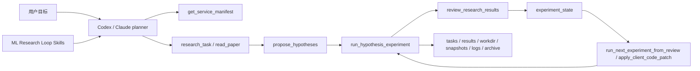

# ML Research Loop 5 分钟发布演示

## 演示目标

向外部用户展示：Codex/Claude 不是只“看到一组 MCP 工具”，而是能借助 skills 和 MCP contract 跑通一个可审计的机器学习研究闭环。

## 架构图



## 准备

```bash
git clone https://github.com/MagicianDu/ml-research-loop.git
cd ml-research-loop
python3 -m venv .venv
. .venv/bin/activate
pip install -e ".[dev]"
```

## 1. 展示 MCP contract

```bash
python3 scripts/mcp_client_acceptance.py --python "$(which python3)"
```

讲解点：

- `contract_version == 2026-07-10.preview.v1`
- required tools 无缺失
- skill contracts 和 tool contracts 已绑定

## 2. 展示 Codex / Claude 接入

```bash
ml-loop init-mcp-config --client codex
ml-loop init-mcp-config --client claude-code --output /tmp/ml-research-loop.mcp.json
ml-loop init-skills --client codex --dry-run
```

讲解点：

- MCP 负责执行工具。
- Skills 负责调用顺序、证据门槛、停止条件和人工确认边界。
- 服务端 LLM 默认关闭，Codex/Claude 作为 planner。

## 3. 跑 bounded golden path

```bash
ML_RESEARCH_LOOP_PYTHON="$(which python3)" \
python3 scripts/mcp_golden_path.py --max-experiments 1 --experiment-duration 30
```

讲解点：

- research context 会进入 hypothesis。
- hypothesis 会进入 bounded experiment。
- review 会返回下一轮 patch 和 planner actions。

## 4. 跑稳定模板 demo

```bash
ml-loop demo list
ML_RESEARCH_LOOP_PYTHON="$(which python3)" \
ml-loop demo run --template byte-lm-smoke --runtime-root .demo_runs/byte-lm-smoke --json
```

讲解点：

- 输出包含 `task_id`、`best_metric`、`task_file`、`result_file` 和 `workspace`。
- 模板会生成本地 byte dataset，不依赖网络、GPU 或服务端 LLM。
- `paper-guided-byte-lm` 模板带 research context 和 reproduction spec，适合展示 ml-intern + autoresearch 融合形态。

## 5. 展示真实数据和复现骨架

```bash
ML_RESEARCH_LOOP_PYTHON="$(which python3)" \
python3 scripts/mcp_real_data_demo.py --max-experiments 1 --experiment-duration 30

ML_RESEARCH_LOOP_PYTHON="$(which python3)" \
python3 scripts/mcp_reproduction_demo.py --max-experiments 1 --experiment-duration 30 --json
```

讲解点：

- `dataset_profile.exists == true`
- `reproduction.readiness.status == ready`
- `grade_report.score > 0`

## 6. 如果现场报错，生成反馈包

```bash
ml-loop feedback-bundle \
  --runtime-root .demo_runs/byte-lm-smoke \
  --task-id demo-byte-lm-smoke \
  --output-dir .demo_runs/feedback-bundle
```

讲解点：

- `feedback-bundle.md` 可以直接贴到 GitHub issue。
- bundle 会脱敏本机路径和常见 token，并保留 contract version、git 状态、result 摘要和 log tail。

## 7. 收束话术

```text
ML Research Loop 的价值不是替代 Codex 或 Claude 的大模型能力，而是把本地 ML 研究执行能力产品化成 MCP + Skills：强模型负责判断，MCP 服务负责受控执行，runtime artifacts 负责审计和复现。
```
