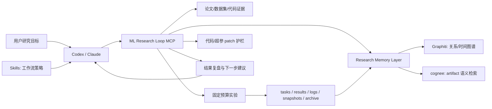

# ML Research Loop 一页式产品说明

## 一句话

ML Research Loop 是一个面向 Codex、Claude 的 MCP + Skills 机器学习研究执行层：让强模型不只会讨论论文和代码，而是能在本地受控环境里检索证据、提出假设、跑实验、复盘结果、修改代码/超参，并保存可复核 artifact。

## 解决什么问题

现在的大模型已经很擅长读论文、写代码和提出实验方向，但真实机器学习研究还缺少一个稳定执行层：

- 检索到的论文、数据集和代码证据需要被结构化，而不是停留在聊天记录里。
- 实验需要固定预算、日志、结果文件、快照和复现说明。
- 代码 patch 和超参改动需要护栏，不能让模型随意改本地项目。
- benchmark 结果需要诚实区分 proof run、debug harness、local scorer 和 official leaderboard。
- Codex/Claude 应该复用自身模型能力做 planner，而不是把智能硬塞进一个黑盒服务端。

ML Research Loop 的目标就是补齐这层。

## 核心架构



## 融合了什么

- **ml-intern 侧能力**：论文阅读、研究检索、数据集/代码 evidence、provider coverage、retrieval diagnostics、证据引用和 cache-aware recovery。
- **autoresearch 侧能力**：`program.md` 任务、`train.py` 工作区、固定预算实验、搜索空间、结果 JSON、日志、快照、多轮 accept/reject。
- **AIDE/PaperBench 启发**：experiment tree、best node、reproduction readiness、rubric grade report 和 proof artifact lifecycle。
- **MCP + Skills 产品形态**：MCP 负责能执行什么，skills 负责应该怎样执行、何时停止、何时请求人工确认。
- **Research Memory Layer 路线**：Graphiti + cognee 作为可选记忆基础设施，把历史复现、实验、patch、失败和 proof bundle 变成可检索经验。

## 已经能展示的结果

| 方向 | 当前证据 | 可宣传边界 |
| --- | --- | --- |
| MCP 客户端接入 | client acceptance `passed`，`94` 个工具，contract `2026-07-10.preview.v1` | 可宣传 Codex/Claude 可接入的 preview MCP product |
| MLE-bench bridge smoke | `spooky-author-identification` 用 fake fixture + fake scorer 跑通插件闭环，baseline/patch score 均为 `1.08468`（未改善） | 只能宣传插件闭环跑通；不能宣传任何模型分数、median 达标或 leaderboard |
| PaperBench harness | official debug split `rice` dummy solver + dummy judge 全链路跑通 | 可宣传 harness path 跑通；不能宣传真实论文复现质量 |
| Codex-assisted review | 对 PaperBench debug artifact 产出审查报告，审查分 `0.0` | 可宣传 keyless review 和诚实证据边界；不能宣传 official PaperBench score |

完整证据见 [../evidence/benchmark-results-index-cn.md](../evidence/benchmark-results-index-cn.md)。

## 为什么值得关注

1. 它把“强模型 planner”和“本地可审计执行层”分开，符合 AI-native 工具的长期形态。
2. 它不是把工具简单包成 MCP，而是把 contract、skills、artifact、patch guard、benchmark proof lifecycle 做成同一个产品边界。
3. 它保留了 ml-intern 与 autoresearch 的核心优势，并把两者连接到可运行的研究闭环。
4. 它诚实处理 benchmark 证据，不把 debug 或 dummy 结果包装成榜单成绩。
5. 它开始补齐长期记忆层，目标是让项目复用过去的研究经验，而不是每次从零开始。

## 谁应该试用

- 想让 Codex/Claude 辅助做模型实验和效果迭代的研究者。
- 正在做 AI research agent、MCP server、自动实验平台的人。
- 想评估“读论文 -> 提假设 -> 跑实验 -> 改代码/超参 -> 留存证据”能否产品化的团队。

## 5 分钟试用

```bash
git clone https://github.com/MagicianDu/ml-research-loop.git
cd ml-research-loop
python3 -m venv .venv
. .venv/bin/activate
pip install -e ".[dev]"
python3 scripts/mcp_client_acceptance.py --python "$(which python3)"
ML_RESEARCH_LOOP_PYTHON="$(which python3)" \
python3 scripts/mcp_golden_path.py --max-experiments 1 --experiment-duration 30
ml-loop demo run --template byte-lm-smoke --runtime-root .demo_runs/byte-lm-smoke --json
```

如果要接入 Codex 或 Claude，请看 [../mcp-client-setup.md](../mcp-client-setup.md)。

## 反馈入口

- GitHub Issues: <https://github.com/MagicianDu/ml-research-loop/issues/new/choose>
- Preview 反馈指南: [../preview-feedback-cn.md](../preview-feedback-cn.md)
