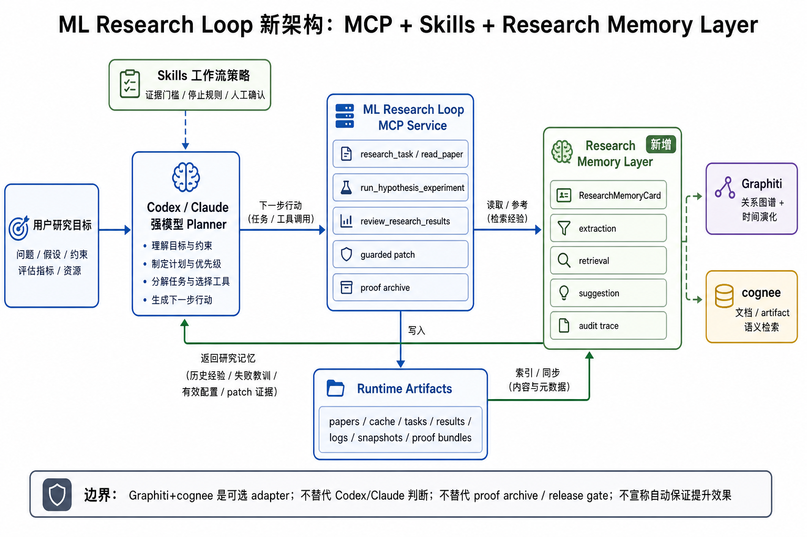

# ML Research Loop 目标架构与设计原则

本文档是 ML Research Loop 后续开发的 **canonical 目标架构**。当 README、路线图、skills、MCP manifest 或具体实现出现表述冲突时，以本文档的职责边界和设计不变量为准。

## 最终产品目标

ML Research Loop 的目标是成为 Codex、Claude 等强模型客户端可调用的 **成熟稳定自动科研执行产品**：让强模型能够围绕一篇或多篇论文，完成研究证据整理、假设拆解、受控实验、代码/超参改动、失败恢复、proof archive、长期经验复用和下一轮迭代。

产品不是把大模型能力塞进服务端，而是提供一个长期可成长的本地执行与记忆底座：

- Codex/Claude 负责理解论文、提出代码/超参改动、审查结果和做研究判断。
- Skills 固化工具顺序、证据门槛、停止规则和人工确认边界。
- MCP Service 执行研究检索、实验、patch、review、proof archive 和 release gate。
- Research Memory Layer 复用历史复现、实验、patch、失败、rollback 和 proof bundle 经验。
- Runtime Artifacts 保存每次运行的事实证据，支持审计、复核和重新打包。

## 新版架构图

## 非目标

在没有独立证据前，项目不得把以下内容作为产品目标或宣传口径：

- 不宣称任意论文都能无人值守完整复现。
- 不宣称任意模型、任务或数据集都能自动提升效果。
- 不宣称本地 proof、debug harness、Codex-assisted review 等同于官方 leaderboard 或官方 PaperBench 分数。
- 不把 Graphiti/cognee 变成默认强依赖，不要求 fresh checkout 依赖外部记忆服务。
- 不让服务端 LLM 默认替代 Codex/Claude 的规划和审查能力。
- 不把 memory suggestion 当成已验证结论或自动执行许可。

## Canonical 分层

| 层 | 职责 | 不负责 |
| --- | --- | --- |
| 用户研究目标 | 提供论文、任务、数据、metric、资源预算和期望产物 | 不直接决定实验执行细节 |
| Codex/Claude Planner | 理解目标、阅读证据、生成 proposal、审查结果、决定下一步 | 不绕过 MCP sandbox 直接执行高风险动作 |
| Skills | 固化工作流、证据阈值、停止条件、失败恢复和人工确认规则 | 不保存事实证据，不替代 release gate |
| MCP Service | 暴露版本化工具、执行检索/实验/patch/review/archive、返回结构化状态 | 默认不隐式调用服务端 LLM，不做无边界代码改动 |
| Runtime Artifacts | 保存 papers、cache、tasks、results、logs、snapshots、proof bundles | 不主动产生建议，只提供事实来源 |
| Research Memory Layer | 把历史证据、实验、patch、失败和 procedure 转成可检索记忆 | 不替代 proof archive，不直接执行实验或 patch |
| Graphiti Adapter | 表达长期关系图谱和时间演化 | 不直接暴露原生接口给客户端 planner |
| cognee Adapter | 检索论文、日志、review、proof bundle 和 memory card 片段 | 不负责 claim boundary 和执行决策 |
| Guardrails | 约束 claim、sandbox、privacy、release gate、human review | 不降低为“提示词建议” |

## 标准数据流

1. 用户给出研究目标、论文或模型改进任务。
2. Codex/Claude 通过 Skills 选择工作流，先读取 `get_service_manifest`。
3. 如果 manifest 暴露 memory 工具，Planner 可先检索相似论文、数据集、metric、失败和 patch 经验。
4. MCP Service 执行 `research_task`、`read_paper`、`propose_hypotheses`、`run_hypothesis_experiment`、`review_research_results` 或 reproduction/benchmark 工具。
5. Runtime Artifacts 记录任务、结果、日志、workspace、snapshots、proof bundle 和 review report。
6. Research Memory Layer 从 artifacts 中抽取 `ResearchMemoryCard`，并写入本地 baseline store；启用 adapter 时同步到 Graphiti/cognee。
7. 下一轮规划时，Planner 同时读取当前 `experiment_state` 和 memory trace，生成新的实验、patch、补检索、停止或人工确认动作。
8. 所有执行仍回到 MCP Service；记忆层只提供带 provenance 的上下文和候选建议。

## 设计不变量

后续开发必须遵守以下不变量：

- **Planner 不变量**：默认由 Codex/Claude 做研究判断；服务端 LLM 只能通过 `run_ai_autoresearch` 显式 opt-in。
- **Execution 不变量**：所有训练、patch、归档、清理和 benchmark 操作必须走 MCP/CLI 的受控入口，遵守 allowed roots。
- **Artifact 不变量**：proof archive 和 runtime artifacts 是事实源；memory card 必须引用 artifact，而不能只保存自然语言总结。
- **Memory 不变量**：Graphiti/cognee 只能作为 optional adapter；项目必须保留 dependency-free local memory baseline。
- **Schema 不变量**：MCP 对外暴露项目自有 schema，例如 `ResearchMemoryCard`、`MemoryEvidenceRef`、`MemoryArtifactRef`、`MemorySuggestion` 和 `MemoryTrace`。
- **Suggestion 不变量**：memory suggestion 必须带 provenance、confidence、known failures 和 claim boundary；不能直接触发执行。
- **Claim 不变量**：任何对外结论都必须标注 evidence level，保持 `official_scores_claimed=false`，除非 publication guard 允许更强声明。
- **Privacy 不变量**：私有论文、私有数据、敏感日志进入记忆前必须显式配置、脱敏并可清理。
- **Release 不变量**：新增能力必须补 release gate 或 optional integration check；不能只靠手工演示证明。

## Research Memory 标准对象

后续实现应围绕这些项目自有对象，而不是外部系统原生对象：

| 对象 | 用途 |
| --- | --- |
| `ResearchMemoryCard` | 一条可复用研究经验，包含类型、摘要、任务上下文、metric、配置、结果、失败和证据引用 |
| `MemoryEvidenceRef` | 指向 paper/source/citation/snippet 的证据引用 |
| `MemoryArtifactRef` | 指向 result/log/patch/proof bundle/review report 的 artifact 引用和 hash |
| `MemorySuggestion` | 给 planner 的下一步候选建议，必须说明来源、适用条件和风险 |
| `MemoryTrace` | 解释某条建议由哪些 memory card、artifact 和证据链支持 |

## Graphiti 与 cognee 的边界

Graphiti 和 cognee 是基础设施，不是产品主语：

- Graphiti 用于关系和时间：适合表达 “某论文 claim 在某数据集上，通过某模型配置和 patch 得到 metric 变化，并经历了失败/rollback”。
- cognee 用于文档和 artifact 检索：适合从论文、日志、proof bundle、review report 和 release evidence 中找相似片段。
- 二者都必须通过 adapter 转成 `ResearchMemoryCard` 和 `MemoryTrace` 后再给 MCP 客户端使用。
- 如果 Graphiti/cognee 不可用，local JSONL/SQLite baseline 仍应支持最小记忆记录和检索。

## 开发优先级

后续开发顺序固定为：

1. **P16.0 Local Memory Baseline**：定义 schema，从现有 fastText P3/P4/P5 artifacts 抽取 memory cards，支持本地检索。
2. **P16.1 Adapter Spike**：接入 Graphiti/cognee optional adapter，验证同一查询能返回关系路径和语义片段。
3. **P16.2 MCP + Skills 集成**：增加 memory record/retrieve/suggest/audit 工具，更新 planner/reproduction/optimizer skills。
4. **P16.3 Privacy + Release Gate**：增加脱敏、清理、export/import、optional integration check 和 release proof。
5. **P13-P15 回归**：再继续 benchmark adapter、official harness 和 public proof run，保证这些 proof 能进入记忆层。

## 术语规范

- **Research Memory Layer**：长期研究记忆层，包含 schema、baseline store、adapter、retrieval 和 audit。
- **Graphiti adapter**：Graphiti 集成层，不是默认运行依赖。
- **cognee adapter**：cognee 集成层，不是默认运行依赖。
- **Memory card**：可被复用的一条研究经验，不等同于 proof。
- **Proof archive**：可审计事实包，是 public claim 的基础。
- **Memory suggestion**：历史经验驱动的候选建议，不代表已验证改动。
- **Client planner**：Codex/Claude 侧的强模型判断层。
- **Server-side autonomous loop**：显式 opt-in 的 `run_ai_autoresearch`，不是默认路径。

## 后续文档维护规则

- README、产品说明、项目总览和路线图必须指向本文档。
- 新增 MCP 工具前，先确认是否改变 canonical 分层；如果改变，先更新本文档。
- 新增 memory 相关工具时，必须同步更新 skills 和 `docs/client-planner-template.md`。
- 宣传材料可以简化表达，但不能改变非目标、claim boundary 和 optional adapter 边界。
