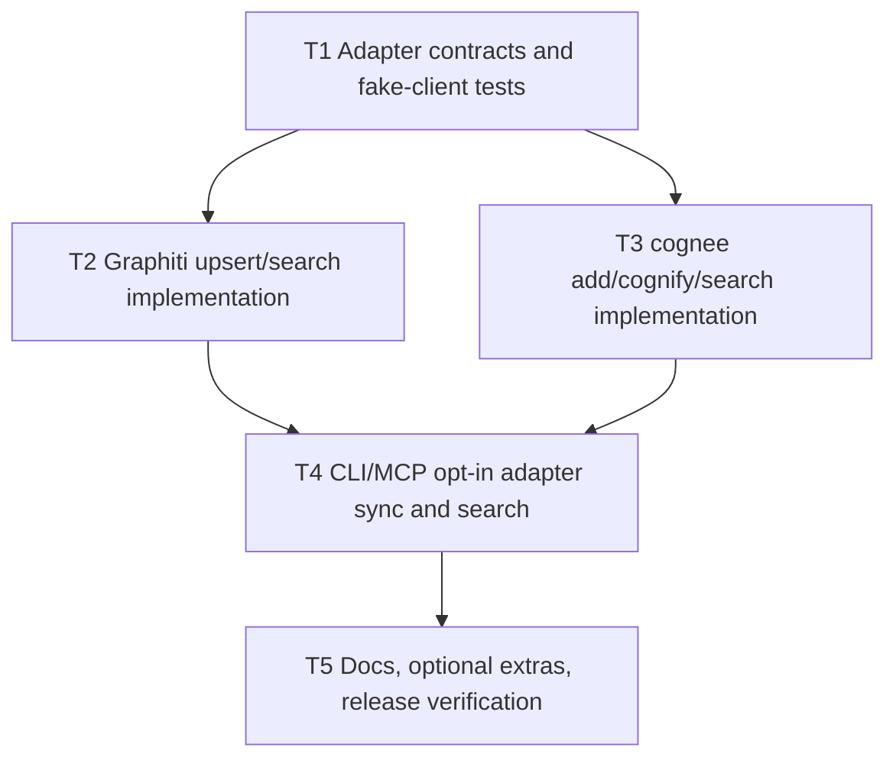

# P17 Graphiti/cognee Real Integration Implementation Plan

> **For agentic workers:** REQUIRED SUB-SKILL: Use superpowers:subagent-driven-development (recommended) or superpowers:executing-plans to implement this plan task-by-task. Steps use checkbox (`- [ ]`) syntax for tracking.

**Goal:** Make Graphiti and cognee optional adapters perform real indexing and retrieval when explicitly configured, while keeping the dependency-free local memory baseline as the default path.

**Architecture:** Keep `ResearchMemoryCard` as the project-owned schema. Adapters translate cards into Graphiti JSON episodes and cognee documents, normalize external search results back into project-owned payloads, and remain opt-in through CLI/MCP flags.

**Tech Stack:** Python stdlib, optional `graphiti-core`, optional `cognee`, existing `lib/research_memory.py`, existing `lib/memory_adapters/`, existing MCP service and CLI, pytest, ruff.

---

## Constraints

- Graphiti/cognee must not become default dependencies.
- Adapter writes/searches must be explicit opt-in via adapter APIs, CLI flags, or MCP arguments.
- Adapter results are advisory memory context, not proof of reproduction quality.
- Release gate must remain green without Graphiti/cognee installed.
- Tests must verify real method calls through fake Graphiti/cognee clients before implementation.

## Task Graph

## Task 1: Adapter Contracts And Red Tests

**Files:**
- Modify: `tests/unit/test_memory_adapters.py`
- Modify: `lib/memory_adapters/__init__.py`

- [ ] Add tests with fake Graphiti client proving `GraphitiMemoryAdapter.upsert(card)` calls `add_episode(...)` with a JSON episode body containing `paper`, `dataset`, `model`, `metric`, `patch/failure`, and `artifact` relations.
- [ ] Add tests with fake Graphiti client proving `GraphitiMemoryAdapter.search(query, limit=2)` calls `search(...)` and normalizes returned edge-like objects.
- [ ] Add tests with fake cognee module proving `CogneeMemoryAdapter.upsert(card)` calls `add(data=..., dataset_name=...)` and `cognify(datasets=[...])`.
- [ ] Add tests with fake cognee module proving `CogneeMemoryAdapter.search(query, limit=2)` calls `search(..., query_type=CHUNKS, datasets=[...], top_k=2)` and normalizes returned chunk dictionaries.
- [ ] Run: `PYTHONPATH=.:.venv/lib/python3.13/site-packages python3 -m pytest tests/unit/test_memory_adapters.py -q`
- [ ] Expected first result: FAIL because current adapters skip configured writes/searches.

## Task 2: Graphiti Real Adapter

**Files:**
- Modify: `lib/memory_adapters/graphiti_adapter.py`

- [ ] Implement dependency discovery for `graphiti_core`.
- [ ] Add explicit configuration via injected client or env vars `ML_RESEARCH_LOOP_GRAPHITI_URI`, `ML_RESEARCH_LOOP_GRAPHITI_USER`, `ML_RESEARCH_LOOP_GRAPHITI_PASSWORD`.
- [ ] Serialize `ResearchMemoryCard` to a structured Graphiti JSON episode.
- [ ] Call Graphiti `add_episode(name=..., episode_body=..., source=EpisodeType.json, source_description=..., reference_time=...)`.
- [ ] Call Graphiti `search(query, num_results=limit)` with fallback to `search(query)` if the installed version does not accept `num_results`.
- [ ] Normalize search results into `{"adapter": "graphiti", "text": ..., "score": ..., "metadata": ...}` dictionaries.

## Task 3: cognee Real Adapter

**Files:**
- Modify: `lib/memory_adapters/cognee_adapter.py`

- [ ] Add explicit configuration via injected module or env var `ML_RESEARCH_LOOP_COGNEE_DATASET`.
- [ ] Serialize `ResearchMemoryCard` to a compact document string with JSON payload and provenance summary.
- [ ] Call `cognee.add(data=..., dataset_name=...)`.
- [ ] Call `cognee.cognify(datasets=[...])` unless explicitly disabled by constructor.
- [ ] Call `cognee.search(query, query_type=SearchType.CHUNKS, datasets=[...], top_k=limit)` with compatibility fallbacks.
- [ ] Normalize search results into project-owned dictionaries.

## Task 4: CLI/MCP Opt-In Surface

**Files:**
- Modify: `scripts/cli.py`
- Modify: `lib/mcp_service.py`
- Modify: `tests/unit/test_cli.py`
- Modify: `tests/unit/test_mcp_service.py`

- [ ] Add CLI flags `memory record-fasttext-release --sync-adapters --adapter graphiti --adapter cognee`.
- [ ] Add CLI flags `memory retrieve --include-adapters --adapter graphiti --adapter cognee`.
- [ ] Add MCP `record_research_memory` optional arguments `sync_adapters` and `adapters`.
- [ ] Add MCP `retrieve_research_memory` optional arguments `include_adapters` and `adapters`.
- [ ] Keep all adapter sync/search disabled unless those flags are provided.
- [ ] Tests should monkeypatch adapter functions and verify payloads include `adapter_results`.

## Task 5: Docs, Optional Extras, Verification

**Files:**
- Modify: `pyproject.toml`
- Modify: `docs/product/research-memory-layer-cn.md`
- Modify: `docs/productization-todos.md`
- Modify: `docs/mcp-client-setup.md`
- Modify: `docs/release-checklist.md`

- [ ] Add optional extras for `memory-graphiti`, `memory-cognee`, and `memory`.
- [ ] Document required external configuration and explicit opt-in behavior.
- [ ] Mark real indexing/retrieval integration complete only for adapter code path; keep production hardening, privacy cleanup, export/import, and hosted setup pending.
- [ ] Run focused tests:
  `PYTHONPATH=.:.venv/lib/python3.13/site-packages python3 -m pytest tests/unit/test_memory_adapters.py tests/unit/test_cli.py tests/unit/test_mcp_service.py -q`
- [ ] Run lint:
  `.venv/bin/ruff check lib/memory_adapters scripts/cli.py lib/mcp_service.py tests/unit/test_memory_adapters.py tests/unit/test_cli.py tests/unit/test_mcp_service.py`
- [ ] Run full release gate:
  `PYTHONPATH=.:.venv/lib/python3.13/site-packages ML_RESEARCH_LOOP_PYTHON="$(which python3)" python3 scripts/release_check.py --json`

