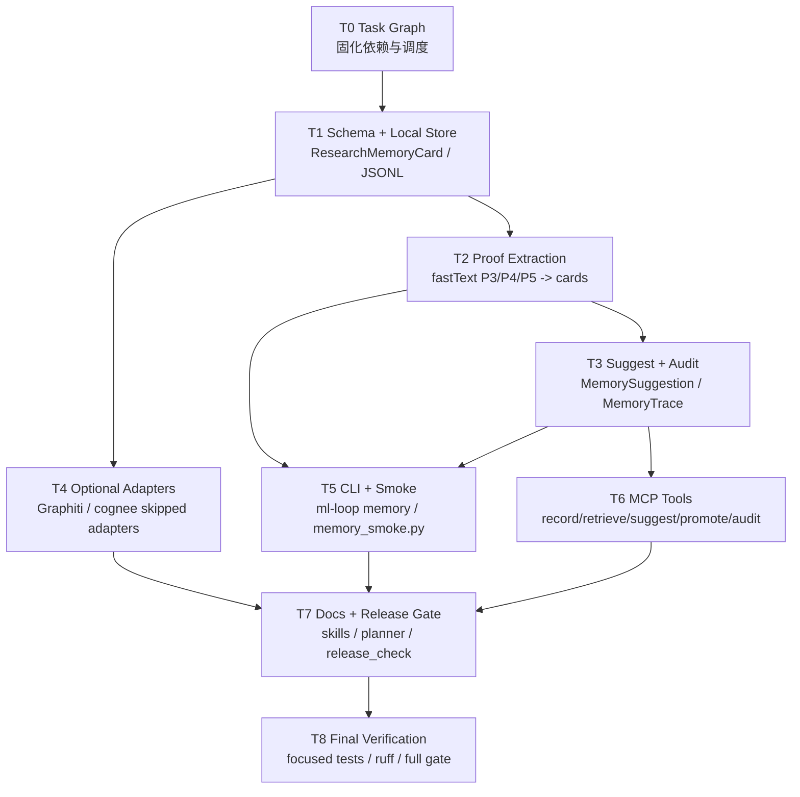

# Research Memory Layer P16 Task Graph

本文档把 `docs/superpowers/plans/2026-05-14-research-memory-layer-p16-cn.md`
拆成可串、并行推进的执行图。后续实现以本图作为调度依据。

## DAG

## 串行关键路径

1. `T1 -> T2 -> T3`：先建立 schema、local store、artifact extraction、
   suggestion 和 audit trace。这是所有后续工作的公共基座。
2. `T6 -> T7 -> T8`：MCP 工具接入后，才能把 docs、skills、release gate
   作为真实产品闭环验收。

## 可并行分支

在 `T3` 完成后，可以并行推进：

- `T4 Optional Adapters`：只依赖 `ResearchMemoryCard` schema，不改变默认运行时。
- `T5 CLI + Smoke`：依赖 extraction/suggestion，负责本地操作和 release smoke。
- `T6 MCP Tools`：依赖 schema/suggestion/audit，负责客户端可调用产品契约。

`T7` 必须等待 `T4/T5/T6` 的接口形态稳定后再收敛文档和 release gate。

## 调度策略

- 当前会话本地推进 `T1 -> T2 -> T3`，因为这三项互相强依赖。
- 基座完成后，可并行分派：
  - Worker A：`T4 Optional Adapters`
  - Worker B：`T5 CLI + Smoke`
  - 主会话：`T6 MCP Tools`
- 最后主会话统一做 `T7/T8`，避免 docs/release gate 多方冲突。

## 每个节点的验收

| 节点 | 最小验收 |
| --- | --- |
| T1 | `tests/unit/test_research_memory.py` schema/store tests pass |
| T2 | fastText release proof artifacts can extract patch/failure cards |
| T3 | suggestions include provenance and `executes_tool=false`; trace returns cards/artifacts |
| T4 | missing Graphiti/cognee dependencies return skipped optional status |
| T5 | CLI can record/retrieve memory; `scripts/memory_smoke.py` passes |
| T6 | MCP tools listed in manifest and return project-owned schema |
| T7 | release gate includes `research-memory-smoke`; docs/skills mention memory tools |
| T8 | focused tests, ruff, `git diff --check`, and full release gate pass |

## 不变量

- Memory suggestion 只建议，不执行。
- Proof archive 和 runtime artifacts 仍是事实源。
- `official_scores_claimed=true` 必须被拒绝。
- Graphiti/cognee 是 optional adapters，不进入默认安装和 release gate 必选路径。
- 私有材料 ingestion 必须显式 opt-in。
