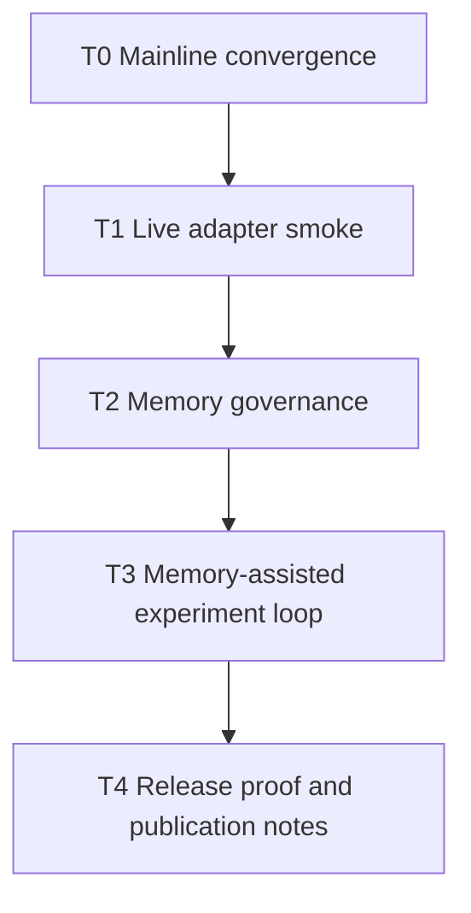

# Post-P17 Product Hardening Implementation Plan

> **For agentic workers:** REQUIRED SUB-SKILL: Use superpowers:subagent-driven-development (recommended) or superpowers:executing-plans to implement this plan task-by-task. Steps use checkbox (`- [ ]`) syntax for tracking.

**Goal:** Move the completed Research Memory Layer work into the mainline, then harden it toward a usable product through live adapter smoke, memory governance, and memory-assisted experiment-loop proof.

**Architecture:** Keep the product boundary unchanged: Codex/Claude remain the planner, MCP remains the guarded executor, Research Memory Layer supplies auditable context, and Graphiti/cognee remain optional infrastructure. Each hardening step must keep the fresh-checkout release gate dependency-free.

**Tech Stack:** Python stdlib, existing MCP service and CLI, optional Graphiti/cognee adapters, pytest, ruff, release gate in `scripts/release_check.py`.

---

## Todo Graph

## P0 Todo: Mainline Convergence

- [x] Confirm `codex/research-memory-layer-p16` is clean.
- [x] Fast-forward local `main` to the reviewed P16/P17 branch.
- [x] Re-check `git status --short --branch`.
- [x] Do not push `main` until explicitly requested.

**Acceptance:** local `main` points at the P17 commit and the worktree is clean.

## P1 Todo: Live Graphiti/cognee Smoke

- [x] Add `scripts/memory_adapter_live_smoke.py`.
- [x] The script must read an existing local memory JSONL store and try `sync_cards_to_adapters(...)` plus `search_memory_adapters(...)`.
- [x] If Graphiti/cognee dependencies or configuration are missing, it must return `status=skipped`, not fail the release gate.
- [x] Add unit tests that monkeypatch adapters and verify `passed` and `skipped` payloads.
- [x] Update `docs/release-checklist.md` with optional live-smoke command.

**Acceptance:** optional smoke can be run by a user with configured Graphiti/cognee, but fresh checkout remains dependency-free.

## P2 Todo: Memory Governance

- [x] Add explicit redaction/export/import/cleanup todo section to product docs if missing.
- [x] Add minimal code-level guardrails for private memory export/import if needed.
- [x] Add tests for private memory rejection and redaction policy boundaries.

**Acceptance:** project can explain what memory may be stored, exported, imported, or deleted before it is used by real researchers.

## P3 Todo: Memory-Assisted Experiment Loop Proof

- [x] Add a bounded demo/proof command or script that retrieves memory first, then produces a client-handoff proposal payload.
- [x] The script must not execute patches automatically; it only proves memory can inform the next proposal.
- [x] Add tests showing retrieved memory appears in the proposal provenance.

**Acceptance:** one proof artifact shows historical memory can influence the next experiment-planning step without bypassing MCP guardrails.

## P4 Todo: Verification And Delivery

- [x] Run focused tests after every implementation chunk.
- [x] Run `ruff`.
- [x] Run full `scripts/release_check.py --json` before calling the work complete.
- [x] Commit in small, reviewable chunks.
- [x] Ask before pushing externally visible changes.
